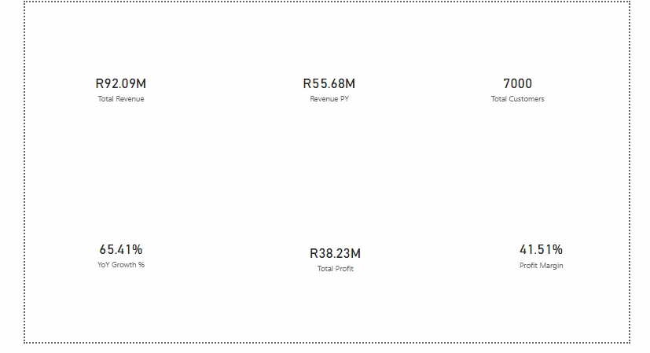
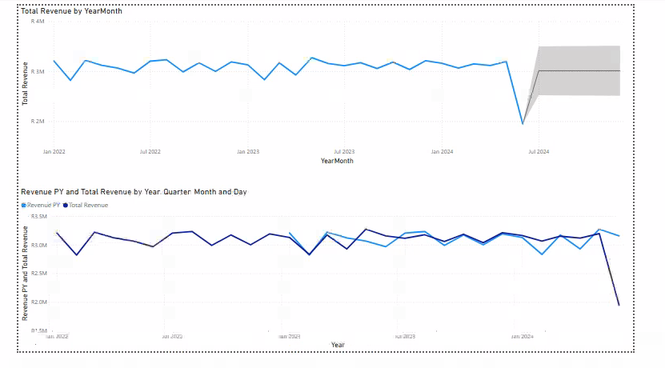
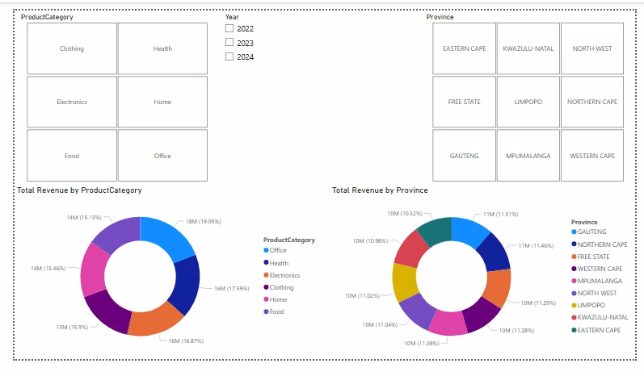
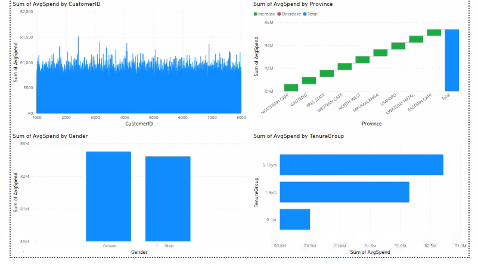
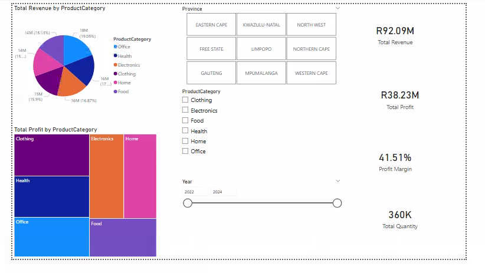

### Retail Analytics & Business Intelligence Solution (RetailX)

#### Project Overview
This project involved building an end-to-end data analytics and business intelligence solution for a simulated South African retail organization. The goal was to integrate, transform, model, and analyze datasets to support decision-making related to sales performance, customer behavior, and regional growth.

#### Tools Used
Power BI,
R,
DAX.

#### Key Tasks Performed
Built interactive Power BI dashboards to analyze sales performance, customer behavior, and regional trends
Designed a star schema data model.
Developed DAX measures for revenue, profit, and growth metrics.
Performed data cleaning and transformation using Power BI and R.

#### Key Insights
Approximately 65% year-over-year revenue growth,
41.51% profit margin,
Identified top-performing regions and product categories.

### Dashboard Preview

